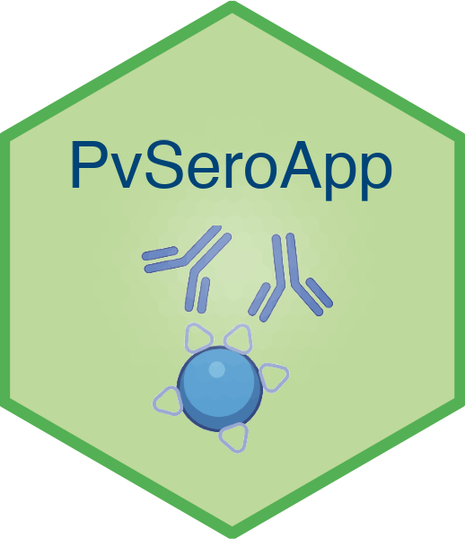

# PvSeroApp

  <table style="width: 100%; max-width: 800px;">
    <tr>
      <td style="width: 30%;"></td>
      <td style="width: 70%;">
        
The source code for the PvSeroApp Shiny web application, which streamlines the data processing of the multi-antigen Luminex-based <em>Plasmodium vivax</em> serological data and applies the machine learning classification algorithm to identify individuals with recent exposure to <em>P. vivax</em>.

      </td>
    </tr>
  </table>

>[!CAUTION]
>The .pdf and .zip download features for this QC component of this application is currently out of order. 
